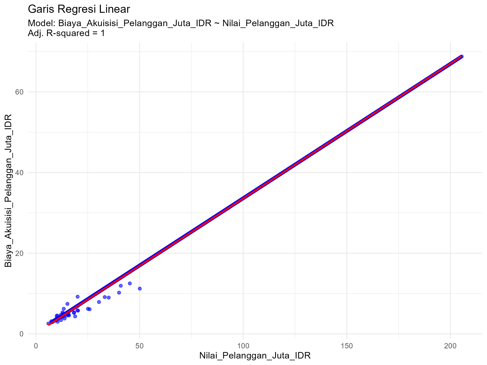

# UAS_STATISTIKA_DAN_PROBABILITAS
 =================================================================
# SKRIP 1: PERSIAPAN DATA
# =================================================================
#
# TUJUAN:
# 1. Memuat library/paket yang dibutuhkan.
# 2. Memuat dataset dari folder 'data'.
# 3. Memeriksa struktur dan ringkasan awal data.
# 4. Membersihkan data (jika diperlukan).
#
# INSTRUKSI:
# 1. Ganti 'nama_file_data.csv' dengan nama file dataset Anda.
# 2. Jalankan setiap baris kode satu per satu (Ctrl+Enter atau Cmd+Enter).
# 3. Perhatikan output di konsol untuk memahami data Anda.
# =================================================================

# -----------------------------------------------------------------
# Langkah 1: Memuat Library
# -----------------------------------------------------------------
# 'tidyverse' adalah kumpulan paket R yang sangat berguna untuk manipulasi dan visualisasi data.
# Jika Anda belum menginstalnya, hapus tanda '#' di bawah dan jalankan.
# install.packages("tidyverse")

library(tidyverse)

# -----------------------------------------------------------------
# Langkah 2: Memuat Dataset
# -----------------------------------------------------------------
# Pastikan dataset Anda sudah berada di dalam folder 'data'.
# Ganti "nama_file_data.csv" dengan nama file Anda.
# Fungsi read_csv() berasal dari paket 'readr' (bagian dari tidyverse).

tryCatch({
  # Ganti nama file di bawah ini
  file_path <- "data/data_startup_saas.csv"
  data <- read_csv(file_path)
  
  # Pesan jika berhasil
  print(paste("Dataset berhasil dimuat dari:", file_path))
  
}, error = function(e) {
  # Pesan jika gagal (misalnya, file tidak ditemukan)
  print("Gagal memuat dataset. Pastikan nama file dan lokasinya sudah benar di dalam folder 'data'.")
  print(e)
})


# -----------------------------------------------------------------
# Langkah 3: Pemeriksaan Awal Data
# -----------------------------------------------------------------
# Periksa beberapa baris pertama data untuk memastikan data termuat dengan benar.
print("Menampilkan 6 baris pertama data:")
print(head(data))

# Lihat struktur data: nama kolom, tipe data (numerik, karakter, dll.), dan jumlah observasi.
print("Menampilkan struktur data:")
glimpse(data)

# Dapatkan ringkasan statistik dasar untuk setiap kolom (terutama kolom numerik).
print("Menampilkan ringkasan statistik data:")
summary(data)


# -----------------------------------------------------------------
# Langkah 4: Pembersihan Data (Opsional, tapi sangat direkomendasikan)
# -----------------------------------------------------------------
# Cek apakah ada nilai yang hilang (missing values) di setiap kolom.
print("Jumlah missing values per kolom:")
print(colSums(is.na(data)))

# Jika ada missing values, Anda harus memutuskan cara menanganinya.
# Opsi 1: Hapus baris yang mengandung missing value (gunakan dengan hati-hati).
# data_bersih <- na.omit(data)

# Opsi 2: Isi missing value dengan nilai tertentu (misalnya, mean atau median).
# Ganti 'nama_kolom' dengan kolom yang ingin Anda isi.
# data_bersih <- data %>%
#   mutate(nama_kolom = ifelse(is.na(nama_kolom), mean(nama_kolom, na.rm = TRUE), nama_kolom))

# Untuk saat ini, kita akan menganggap data sudah bersih dan menggunakan dataset asli.
# Jika Anda melakukan pembersihan, gunakan variabel 'data_bersih' untuk analisis selanjutnya.
data_bersih <- data

# Pesan akhir
print("Persiapan data selesai. Variabel 'data_bersih' siap digunakan untuk analisis selanjutnya.")

# =================================================================
# SKRIP 2: ANALISIS STATISTIK DESKRIPTIF
# =================================================================
#
# TUJUAN:
# 1. Menghitung ukuran pemusatan data (mean, median, modus).
# 2. Menghitung ukuran sebaran data (standar deviasi, range, kuartil).
# 3. Membuat visualisasi data (histogram dan boxplot) untuk memahami distribusi.
#
# INSTRUKSI:
# 1. Pastikan Anda sudah menjalankan skrip '01_data_preparation.R' terlebih dahulu.
# 2. Ganti 'nama_kolom_numerik' dengan nama kolom dari dataset Anda yang ingin dianalisis.
# 3. Simpan plot yang dihasilkan ke dalam folder 'results'.
# =================================================================

# -----------------------------------------------------------------
# Langkah 0: Persiapan
# -----------------------------------------------------------------
# Jika variabel 'data_bersih' belum ada, jalankan skrip 01 terlebih dahulu.
if (!exists("data_bersih")) {
  source("01_data_preparation.R")
  print("Menjalankan skrip 01_data_preparation.R...")
}

# Ganti dengan nama kolom numerik yang ingin Anda analisis dari dataset Anda.
# Contoh: kolom_analisis <- "harga_rumah"
kolom_analisis <- "Pendapatan_Tahunan_Miliar_IDR" 

# Pastikan kolom yang dipilih ada di dalam data
if(!kolom_analisis %in% names(data_bersih)) {
  stop(paste("Kolom '", kolom_analisis, "' tidak ditemukan dalam data. Silakan periksa kembali nama kolom pada file 02_analisis_deskriptif.R"))
}

# -----------------------------------------------------------------
# Langkah 1: Ukuran Pemusatan Data
# -----------------------------------------------------------------
# Mean (Rata-rata)
mean_value <- mean(data_bersih[[kolom_analisis]], na.rm = TRUE)
print(paste("Mean dari", kolom_analisis, ":", round(mean_value, 2)))

# Median (Nilai Tengah)
median_value <- median(data_bersih[[kolom_analisis]], na.rm = TRUE)
print(paste("Median dari", kolom_analisis, ":", round(median_value, 2)))

# Modus (Nilai yang Paling Sering Muncul)
# R tidak memiliki fungsi modus bawaan, jadi kita bisa membuatnya sendiri.
get_mode <- function(v) {
  uniqv <- unique(v)
  uniqv[which.max(tabulate(match(v, uniqv)))]
}
mode_value <- get_mode(data_bersih[[kolom_analisis]])
print(paste("Modus dari", kolom_analisis, ":", mode_value))


# -----------------------------------------------------------------
# Langkah 2: Ukuran Sebaran Data
# -----------------------------------------------------------------
# Standar Deviasi
sd_value <- sd(data_bersih[[kolom_analisis]], na.rm = TRUE)
print(paste("Standar Deviasi dari", kolom_analisis, ":", round(sd_value, 2)))

# Range (Jangkauan)
range_value <- range(data_bersih[[kolom_analisis]], na.rm = TRUE)
print(paste("Range dari", kolom_analisis, ":", range_value[1], "-", range_value[2]))

# Kuartil dan Ringkasan 5 Angka (Min, Q1, Median, Q3, Max)
summary_value <- summary(data_bersih[[kolom_analisis]])
print(paste("Ringkasan 5 Angka untuk", kolom_analisis, ":"))
print(summary_value)


# -----------------------------------------------------------------
# Langkah 3: Visualisasi Data
# -----------------------------------------------------------------
# A. Histogram
# Histogram membantu melihat bentuk distribusi data.
hist_plot <- ggplot(data_bersih, aes_string(x = kolom_analisis)) +
  geom_histogram(bins = 20, fill = "skyblue", color = "white") +
  geom_vline(aes(xintercept = mean_value), color = "red", linetype = "dashed", size = 1) +
  labs(
    title = paste("Histogram dari", kolom_analisis),
    subtitle = paste("Garis merah putus-putus menunjukkan Mean =", round(mean_value, 2)),
    x = kolom_analisis,
    y = "Frekuensi"
  ) +
  theme_minimal()

print(hist_plot)

# Menyimpan histogram ke folder 'results'
ggsave(
  filename = paste0("../results/histogram_", kolom_analisis, ".png"),
  plot = hist_plot,
  width = 8,
  height = 6
)
print(paste("Histogram disimpan di folder 'results' dengan nama histogram_", kolom_analisis, ".png", sep=""))


# B. Boxplot
# Boxplot berguna untuk mengidentifikasi pencilan (outliers) dan melihat sebaran kuartil.
box_plot <- ggplot(data_bersih, aes_string(y = kolom_analisis)) +
  geom_boxplot(fill = "lightgreen", color = "black") +
  labs(
    title = paste("Boxplot dari", kolom_analisis),
    y = kolom_analisis
  ) +
  theme_minimal()

print(box_plot)

# Menyimpan boxplot ke folder 'results'
ggsave(
  filename = paste0("../results/boxplot_", kolom_analisis, ".png"),
  plot = box_plot,
  width = 6,
  height = 8
)
print(paste("Boxplot disimpan di folder 'results' dengan nama boxplot_", kolom_analisis, ".png", sep=""))

# Pesan akhir
print("Analisis deskriptif selesai. Jangan lupa untuk menginterpretasikan hasilnya di file README.md.")

# =================================================================
# SKRIP 3: UJI ASUMSI (UJI NORMALITAS)
# =================================================================
#
# TUJUAN:
# 1. Menguji apakah data (atau residu model) terdistribusi normal.
# 2. Normalitas adalah asumsi penting untuk banyak uji statistik parametrik.
#
# METODE:
# 1. Visual: Q-Q Plot (Quantile-Quantile Plot).
# 2. Statistik: Uji Shapiro-Wilk.
#
# INSTRUKSI:
# 1. Pastikan Anda sudah menjalankan skrip '01_data_preparation.R'.
# 2. Ganti 'nama_kolom_numerik' dengan nama kolom yang sama dengan yang Anda analisis di skrip 02.
# =================================================================

# -----------------------------------------------------------------
# Langkah 0: Persiapan
# -----------------------------------------------------------------
# Jika variabel 'data_bersih' belum ada, jalankan skrip 01 terlebih dahulu.
if (!exists("data_bersih")) {
  source("01_data_preparation.R")
  print("Menjalankan skrip 01_data_preparation.R...")
}

# Ganti dengan nama kolom numerik yang ingin Anda uji normalitasnya.
# Ini sebaiknya kolom yang sama dengan yang Anda gunakan di skrip sebelumnya.
kolom_uji <- "Pendapatan_Tahunan_Miliar_IDR"

# Pastikan kolom yang dipilih ada di dalam data
if(!kolom_uji %in% names(data_bersih)) {
  stop(paste("Kolom '", kolom_uji, "' tidak ditemukan dalam data. Silakan periksa kembali nama kolom pada file 03_uji_asumsi.R"))
}

# -----------------------------------------------------------------
# Langkah 1: Uji Normalitas dengan Metode Visual (Q-Q Plot)
# -----------------------------------------------------------------
# Q-Q Plot membandingkan distribusi data Anda dengan distribusi normal teoritis.
# Jika data terdistribusi normal, titik-titik akan berada di sekitar garis lurus.

# Membuat Q-Q Plot
qq_plot <- ggplot(data_bersih, aes_string(sample = kolom_uji)) +
  stat_qq() +
  stat_qq_line(color = "red", linetype = "dashed") +
  labs(
    title = "Q-Q Plot untuk Uji Normalitas",
    subtitle = paste("Variabel:", kolom_uji),
    x = "Kuantil Teoritis (Normal)",
    y = "Kuantil Sampel"
  ) +
  theme_minimal()

print(qq_plot)

# Menyimpan Q-Q Plot ke folder 'results'
ggsave(
  filename = paste0("../results/qqplot_", kolom_uji, ".png"),
  plot = qq_plot,
  width = 8,
  height = 6
)
print(paste("Q-Q Plot disimpan di folder 'results' dengan nama qqplot_", kolom_uji, ".png", sep=""))


# -----------------------------------------------------------------
# Langkah 2: Uji Normalitas dengan Metode Statistik (Shapiro-Wilk)
# -----------------------------------------------------------------
# Uji Shapiro-Wilk adalah salah satu uji statistik yang paling umum untuk normalitas.
#
# Hipotesis:
# H0 (Hipotesis Nol): Data terdistribusi normal.
# H1 (Hipotesis Alternatif): Data tidak terdistribusi normal.
#
# Kaidah Keputusan:
# - Jika p-value > 0.05, maka kita GAGAL MENOLAK H0 (data dianggap normal).
# - Jika p-value <= 0.05, maka kita TOLAK H0 (data dianggap tidak normal).

# Melakukan uji Shapiro-Wilk
# Uji ini bekerja baik untuk sampel di bawah 5000.
if(nrow(data_bersih) < 5000) {
  shapiro_test_result <- shapiro.test(data_bersih[[kolom_uji]])
  
  print("--- Hasil Uji Normalitas Shapiro-Wilk ---")
  print(shapiro_test_result)
  
  # Interpretasi otomatis
  p_value <- shapiro_test_result$p.value
  if (p_value > 0.05) {
    print(paste("Interpretasi: p-value =", round(p_value, 4), "> 0.05. Data kemungkinan besar terdistribusi normal."))
  } else {
    print(paste("Interpretasi: p-value =", round(p_value, 4), "<= 0.05. Data kemungkinan besar TIDAK terdistribusi normal."))
  }
  
} else {
  print("Jumlah data lebih dari 5000, uji Shapiro-Wilk mungkin tidak akurat. Pertimbangkan uji lain seperti Kolmogorov-Smirnov atau andalkan inspeksi visual (Q-Q Plot).")
}

# Pesan akhir
print("Uji normalitas selesai. Gunakan hasil ini untuk menentukan apakah analisis parametrik (seperti korelasi Pearson) sesuai untuk data Anda.")

# =================================================================
# SKRIP 4: ANALISIS KORELASI
# =================================================================
#
# TUJUAN:
# 1. Mengukur kekuatan dan arah hubungan linear antara dua variabel numerik.
# 2. Memvisualisasikan hubungan tersebut menggunakan scatter plot.
#
# METODE:
# 1. Koefisien Korelasi Pearson (jika data normal dan hubungannya linear).
# 2. Koefisien Korelasi Spearman (jika data tidak normal atau hubungannya monoton).
#
# INSTRUKSI:
# 1. Pastikan Anda sudah menjalankan skrip '01_data_preparation.R'.
# 2. Ganti 'variabel_x' dan 'variabel_y' dengan nama dua kolom numerik yang ingin Anda analisis.
# =================================================================

# -----------------------------------------------------------------
# Langkah 0: Persiapan
# -----------------------------------------------------------------
# Jika variabel 'data_bersih' belum ada, jalankan skrip 01 terlebih dahulu.
if (!exists("data_bersih")) {
  source("01_data_preparation.R")
  print("Menjalankan skrip 01_data_preparation.R...")
}

# Ganti dengan nama dua kolom numerik yang ingin Anda hubungkan.
# Contoh:
# var_x <- "luas_bangunan"
# var_y <- "harga_rumah"

var_x <- "Biaya_Akuisisi_Pelanggan_Juta_IDR" 
var_y <- "Nilai_Pelanggan_Juta_IDR"

# Pastikan kolom yang dipilih ada di dalam data
if(!var_x %in% names(data_bersih) || !var_y %in% names(data_bersih)) {
  stop(paste("Satu atau kedua kolom ('", var_x, "', '", var_y, "') tidak ditemukan. Periksa kembali nama kolom pada file 04_analisis_korelasi.R"))
}

# -----------------------------------------------------------------
# Langkah 1: Visualisasi Hubungan dengan Scatter Plot
# -----------------------------------------------------------------
# Scatter plot adalah cara terbaik untuk melihat pola hubungan antara dua variabel.
scatter_plot <- ggplot(data_bersih, aes_string(x = var_x, y = var_y)) +
  geom_point(alpha = 0.6, color = "blue") +
  geom_smooth(method = "lm", se = FALSE, color = "red") + # Menambah garis tren linear
  labs(
    title = paste("Scatter Plot antara", var_x, "dan", var_y),
    subtitle = "Garis merah menunjukkan tren linear",
    x = var_x,
    y = var_y
  ) +
  theme_minimal()

print(scatter_plot)

# Menyimpan scatter plot ke folder 'results'
ggsave(
  filename = paste0("../results/scatterplot_", var_x, "_vs_", var_y, ".png"),
  plot = scatter_plot,
  width = 8,
  height = 6
)
print(paste("Scatter plot disimpan di folder 'results'."))


# -----------------------------------------------------------------
# Langkah 2: Menghitung Koefisien Korelasi
# -----------------------------------------------------------------
# Koefisien korelasi (r) berkisar dari -1 hingga +1.
# - Mendekati +1: Korelasi positif kuat
# - Mendekati -1: Korelasi negatif kuat
# - Mendekati 0: Korelasi lemah atau tidak ada korelasi linear

# Uji korelasi memberikan koefisien (r) dan p-value.
# p-value menguji signifikansi korelasi.
# H0: Tidak ada korelasi (r = 0).
# H1: Ada korelasi (r != 0).
# Jika p-value <= 0.05, korelasi dianggap signifikan secara statistik.

# Pilih metode yang sesuai. 'pearson' adalah default dan umum digunakan.
# Gunakan 'spearman' jika data Anda tidak terdistribusi normal (berdasarkan skrip 03).
correlation_test <- cor.test(data_bersih[[var_x]], data_bersih[[var_y]], method = "pearson")

print(paste("--- Hasil Uji Korelasi antara", var_x, "dan", var_y, "---"))
print(correlation_test)

# Interpretasi otomatis
cor_value <- correlation_test$estimate
p_value <- correlation_test$p.value

print("--- Interpretasi Sederhana ---")
print(paste("Koefisien Korelasi (r) =", round(cor_value, 3)))

# Interpretasi kekuatan hubungan
if (abs(cor_value) >= 0.7) {
  strength <- "kuat"
} else if (abs(cor_value) >= 0.4) {
  strength <- "sedang"
} else if (abs(cor_value) >= 0.1) {
  strength <- "lemah"
} else {
  strength <- "sangat lemah atau tidak ada"
}

# Interpretasi arah hubungan
if (cor_value > 0) {
  direction <- "positif"
} else if (cor_value < 0) {
  direction <- "negatif"
} else {
  direction <- ""
}

print(paste("Ini menunjukkan adanya korelasi", direction, strength, "antara", var_x, "dan", var_y, "."))

# Interpretasi signifikansi
if (p_value <= 0.05) {
  print(paste("p-value =", round(p_value, 5), "adalah signifikan secara statistik (<= 0.05), sehingga kita yakin ada korelasi nyata di populasi."))
} else {
  print(paste("p-value =", round(p_value, 5), "tidak signifikan secara statistik (> 0.05), sehingga korelasi yang teramati bisa jadi hanya kebetulan."))
}

# Pesan akhir
print("Analisis korelasi selesai. Jangan lupa tulis interpretasi lengkap Anda di file README.md.")

# =================================================================
# SKRIP 5: ANALISIS REGRESI LINEAR SEDERHANA
# =================================================================
#
# TUJUAN:
# 1. Membuat model prediksi sederhana untuk satu variabel dependen (Y)
#    berdasarkan satu variabel independen (X).
# 2. Menginterpretasikan koefisien model (intercept dan slope).
# 3. Mengevaluasi seberapa baik model tersebut (R-squared).
#
# INSTRUKSI:
# 1. Pastikan Anda sudah menjalankan skrip '01_data_preparation.R'.
# 2. Tentukan mana 'variabel_dependen' (Y, yang ingin diprediksi) dan
#    'variabel_independen' (X, sebagai prediktor).
# 3. Biasanya, variabel ini sama dengan yang digunakan dalam analisis korelasi.
# =================================================================

# -----------------------------------------------------------------
# Langkah 0: Persiapan
# -----------------------------------------------------------------
# Jika variabel 'data_bersih' belum ada, jalankan skrip 01 terlebih dahulu.
if (!exists("data_bersih")) {
  source("01_data_preparation.R")
  print("Menjalankan skrip 01_data_preparation.R...")
}

# Tentukan variabel dependen (Y) dan independen (X).
# Y adalah variabel yang ingin Anda prediksi.
# X adalah variabel yang Anda gunakan untuk memprediksi.
# Contoh:
# var_dependen <- "harga_rumah"
# var_independen <- "luas_bangunan"

var_dependen <- "Biaya_Akuisisi_Pelanggan_Juta_IDR"   # Seringkali sama dengan var_y dari skrip korelasi
var_independen <- "Nilai_Pelanggan_Juta_IDR" # Seringkali sama dengan var_x dari skrip korelasi

# Pastikan kolom yang dipilih ada di dalam data
if(!var_dependen %in% names(data_bersih) || !var_independen %in% names(data_bersih)) {
  stop(paste("Satu atau kedua kolom ('", var_dependen, "', '", var_independen, "') tidak ditemukan. Periksa kembali nama kolom pada file 05_analisis_regresi.R"))
}

# -----------------------------------------------------------------
# Langkah 1: Membangun Model Regresi Linear
# -----------------------------------------------------------------
# Fungsi lm() (linear model) digunakan untuk membuat model regresi.
# Formula `Y ~ X` dibaca "Y diprediksi oleh X".

model_regresi <- lm(as.formula(paste(var_dependen, "~", var_independen)), data = data_bersih)


# -----------------------------------------------------------------
# Langkah 2: Melihat dan Menginterpretasikan Hasil Model
# -----------------------------------------------------------------
# Fungsi summary() memberikan output yang sangat kaya informasi.
summary_model <- summary(model_regresi)

print("--- Ringkasan Model Regresi Linear ---")
print(summary_model)

print("--- Interpretasi Penting dari Model ---")

# A. Koefisien (Coefficients)
# - (Intercept): Nilai Y ketika X = 0.
# - [nama var_independen]: Slope, atau perubahan pada Y untuk setiap kenaikan 1 unit pada X.
# - Pr(>|t|): p-value untuk koefisien. Jika <= 0.05, artinya variabel independen signifikan secara statistik dalam memprediksi variabel dependen.

intercept_val <- coef(model_regresi)[1]
slope_val <- coef(model_regresi)[2]

print(paste("1. Persamaan Model: ", var_dependen, " = ", round(intercept_val, 2), " + ", round(slope_val, 2), " * ", var_independen))
print(paste("   - Intercept (b0) =", round(intercept_val, 2), "-> Nilai prediksi", var_dependen, "ketika", var_independen, "adalah 0."))
print(paste("   - Slope (b1) =", round(slope_val, 2), "-> Setiap kenaikan 1 unit pada", var_independen, ", diprediksi akan mengubah", var_dependen, "sebesar", round(slope_val, 2), "unit."))

# B. R-squared (Koefisien Determinasi)
# - Adjusted R-squared: Persentase variasi dalam variabel dependen (Y) yang dapat
#   dijelaskan oleh variabel independen (X) dalam model ini.
# - Nilainya berkisar dari 0 hingga 1 (atau 0% hingga 100%).

adj_r_squared <- summary_model$adj.r.squared
print(paste("2. Adjusted R-squared =", round(adj_r_squared, 3), "atau", round(adj_r_squared * 100, 1), "%" ))
print(paste("   - Artinya,", round(adj_r_squared * 100, 1), "% variasi pada", var_dependen, "dapat dijelaskan oleh", var_independen, "melalui model ini."))


# -----------------------------------------------------------------
# Langkah 3: Visualisasi Garis Regresi
# -----------------------------------------------------------------
# Kita bisa menggunakan scatter plot dari skrip sebelumnya dan menambahkan garis regresi dari model ini.
# Garis ini adalah representasi visual dari persamaan model kita.

plot_regresi <- ggplot(data_bersih, aes_string(x = var_independen, y = var_dependen)) +
  geom_point(alpha = 0.6, color = "blue") +
  geom_smooth(method = "lm", se = TRUE, color = "red") + # `se = TRUE` menampilkan confidence interval
  labs(
    title = "Garis Regresi Linear",
    subtitle = paste0(
      "Model: ", var_dependen, " ~ ", var_independen, "\n",
      "Adj. R-squared = ", round(adj_r_squared, 3)
    ),
    x = var_independen,
    y = var_dependen
  ) +
  theme_minimal()

print(plot_regresi)

# Menyimpan plot regresi ke folder 'results'
ggsave(
  filename = paste0("../results/plot_regresi_", var_independen, "_vs_", var_dependen, ".png"),
  plot = plot_regresi,
  width = 8,
  height = 6
)
print(paste("Plot regresi disimpan di folder 'results'."))

# Pesan akhir
print("Analisis regresi selesai. Ini adalah dasar dari pemodelan prediktif. Jangan lupa tulis interpretasi Anda di README.md.")


# Tugas Analisis Statistik: Deskriptif, Korelasi, dan Regresi

## 1. Informasi Penyusun

- **Nama:** `[KADEK TITO MARDITYA PUTRA]`
- **NIM:** `[2515091104]`
- **Program Studi:** `[SISTEM INFORMASI]`
- **Mata Kuliah:** Statistika dan Probabilitas

---

## 2. Deskripsi Proyek

Dataset yang digunakan adalah data data_startup_saas.csv yang berisi informasi tentang karakteristik dan kinerja bisnis startup SaaS. Variabel kunci dalam dataset ini meliputi Pendapatan_Tahunan_Miliar_IDR, Biaya_Akuisisi_Pelanggan_Juta_IDR, dan Nilai_Pelanggan_Juta_IDR. Tujuan dari proyek ini adalah untuk memahami karakteristik data melalui analisis statistik deskriptif, menguji hubungan antara Biaya_Akuisisi_Pelanggan_Juta_IDR dan Nilai_Pelanggan_Juta_IDR melalui analisis korelasi, serta memprediksi Biaya_Akuisisi_Pelanggan_Juta_IDR menggunakan Nilai_Pelanggan_Juta_IDR sebagai prediktor melalui analisis regresi linear.
*Contoh:*


---

## 3. Struktur Proyek

Proyek ini diorganisir ke dalam beberapa folder:
- `/data`: Berisi dataset mentah yang digunakan untuk analisis.
- `/scripts`: Berisi semua skrip R yang digunakan dalam analisis, diurutkan berdasarkan alur kerja.
- `/results`: Berisi output dari analisis, seperti plot, gambar, atau tabel ringkasan.

---

## 4. Cara Menjalankan Analisis

Untuk mereproduksi hasil analisis ini, ikuti langkah-langkah berikut:
1. Pastikan Anda memiliki R dan RStudio terinstal.
2. Buka proyek R ini di RStudio.
3. Instal paket yang diperlukan dengan menjalankan perintah berikut di konsol R:
   ```R
   # install.packages(c("tidyverse", "corrplot", "knitr"))
   ```
4. Jalankan skrip di dalam folder `/scripts` secara berurutan, mulai dari `01_data_preparation.R` hingga `05_analisis_regresi.R`.

---

## 5. Hasil dan Interpretasi

Di bagian ini, mahasiswa diharapkan untuk menyajikan dan menginterpretasikan hasil dari setiap tahap analisis.

### 5.1. Statistik Deskriptif
- **Ukuran Pemusatan (Mean, Median, Modus):**
  - *Tabel atau ringkasan...*
  	Mean	31.88
  	Median	31.30
  	Modus	1.87
	

  - *Interpretasi:* Jelaskan apa arti dari nilai-nilai tersebut terkait dengan data Anda.
- **Ukuran Sebaran (Standar Deviasi, Range, Kuartil):**
  - *Tabel atau ringkasan...*
  Tabel Ukuran Sebaran Pendapatan Tahunan
Ukuran Sebaran	Nilai
Standar Deviasi	19.79
Minimum	1.00
Kuartil 1 (Q1)	14.31
Median (Q2)	31.30
Kuartil 3 (Q3)	49.04
Maximum	66.89
Ringkasan Interpretasi

Standar deviasi yang cukup besar menunjukkan bahwa pendapatan tahunan startup SaaS memiliki variasi yang tinggi. Nilai minimum dan maksimum yang berjauhan menunjukkan perbedaan pendapatan yang besar antar startup. Berdasarkan kuartil, sebagian besar data berada pada rentang pendapatan menengah, sehingga data tidak terkonsentrasi pada satu nilai tertentu.

  - *Interpretasi:* Jelaskan seberapa menyebar data Anda berdasarkan nilai-nilai ini.
- **Visualisasi (Histogram/Boxplot):**
  - *Sematkan gambar plot dari folder /results...*
  
  - *Interpretasi:* Jelaskan wawasan apa yang Anda dapatkan dari bentuk distribusi data.
Histogram menunjukkan bahwa pendapatan tahunan startup SaaS tersebar luas dari nilai rendah hingga tinggi. Garis mean sebesar 31,88 miliar IDR berada di tengah sebaran data, menandakan bahwa rata-rata pendapatan berada pada kisaran menengah. Distribusi data tidak terkonsentrasi pada satu nilai tertentu, sehingga menunjukkan variasi pendapatan yang cukup besar antar startup.
### 5.2. Uji Normalitas
- **Hasil Uji Shapiro-Wilk:**
  - *Nilai p-value...*
  0,01
  - *Interpretasi:* Apakah data Anda terdistribusi normal berdasarkan hasil uji? Apa implikasinya?
  Nilai p-value uji Shapiro–Wilk sebesar 1.497 × 10⁻¹⁴, lebih kecil dari 0.05, sehingga data tidak terdistribusi normal.
- **Plot Q-Q:**
  - *Sematkan gambar plot dari folder /results...*
  
  - *Interpretasi:* Apakah titik-titik data mengikuti garis lurus? Apa artinya?
Titik-titik data pada Q-Q plot tidak sepenuhnya mengikuti garis lurus. Hal ini menunjukkan bahwa data tidak berdistribusi normal, sehingga terdapat penyimpangan dari distribusi normal teoretis.
### 5.3. Analisis Korelasi
- **Nilai Koefisien Korelasi:**
  - *Nilai r...*
r: 0.999
  - *Interpretasi:* Seberapa kuat dan apa arah hubungan antara dua variabel yang Anda uji? (misalnya, korelasi positif kuat, negatif lemah, atau tidak ada korelasi).
  Nilai koefisien korelasi sebesar 0.999 menunjukkan adanya hubungan positif yang sangat kuat antara Biaya_Akuisisi_Pelanggan_Juta_IDR dan Nilai_Pelanggan_Juta_IDR. Artinya, ketika nilai pelanggan meningkat, biaya akuisisi pelanggan juga cenderung meningkat.
- **Visualisasi (Scatter Plot):**
  - *Sematkan gambar plot dari folder /results...*

  - *Interpretasi:* Apakah pola pada scatter plot mendukung hasil koefisien korelasi?
Scatter plot menunjukkan pola titik-titik yang membentuk garis naik dari kiri ke kanan. Pola ini mendukung hasil koefisien korelasi yang menunjukkan hubungan positif yang sangat kuat antara biaya akuisisi pelanggan dan nilai pelanggan.
### 5.4. Analisis Regresi
- **Model Regresi:**
  - *Persamaan regresi: Y = b0 + b1*X*
Y=0.14+0.33X
  - *Interpretasi:* Jelaskan arti dari koefisien intercept (b0) dan slope (b1) dalam konteks data Anda.
Y = Biaya_Akuisisi_Pelanggan_Juta_IDR
X = Nilai_Pelanggan_Juta_IDR
Intercept (b₀ = 0.14) menunjukkan perkiraan biaya akuisisi pelanggan ketika nilai pelanggan bernilai nol.
Slope (b₁ = 0.33) menunjukkan bahwa setiap kenaikan 1 juta IDR nilai pelanggan akan meningkatkan biaya akuisisi pelanggan sebesar 0.33 juta IDR.
- **Evaluasi Model (R-squared):**
  - *Nilai R-squared...*
R-squared: 0.999
  - *Interpretasi:* Berapa persen variasi dari variabel dependen yang dapat dijelaskan oleh model regresi Anda?
Nilai R-squared sebesar 0.999 menunjukkan bahwa sekitar 99.9% variasi Biaya_Akuisisi_Pelanggan_Juta_IDR dapat dijelaskan oleh Nilai_Pelanggan_Juta_IDR dalam model regresi. Hal ini menunjukkan bahwa model memiliki kemampuan penjelasan yang sangat tinggi terhadap data.
- **Visualisasi (Garis Regresi pada Scatter Plot):**
  - *Sematkan gambar plot dari folder /results...*

  - *Interpretasi:* Jelaskan bagaimana garis regresi merepresentasikan hubungan antara variabel.
Garis regresi menunjukkan hubungan linear positif, di mana peningkatan nilai pelanggan diikuti oleh peningkatan biaya akuisisi pelanggan.

---

## 6. Kesimpulan

Rangkum temuan utama dari analisis Anda dalam beberapa kalimat. Apa wawasan paling penting yang Anda peroleh?
Berdasarkan hasil analisis yang dilakukan, pendapatan tahunan startup SaaS menunjukkan variasi yang cukup besar dan tidak terdistribusi normal. Analisis korelasi menunjukkan adanya hubungan positif yang sangat kuat antara biaya akuisisi pelanggan dan nilai pelanggan. Hasil regresi linear menunjukkan bahwa nilai pelanggan berpengaruh signifikan terhadap biaya akuisisi pelanggan, dengan kemampuan penjelasan model yang sangat tinggi.

